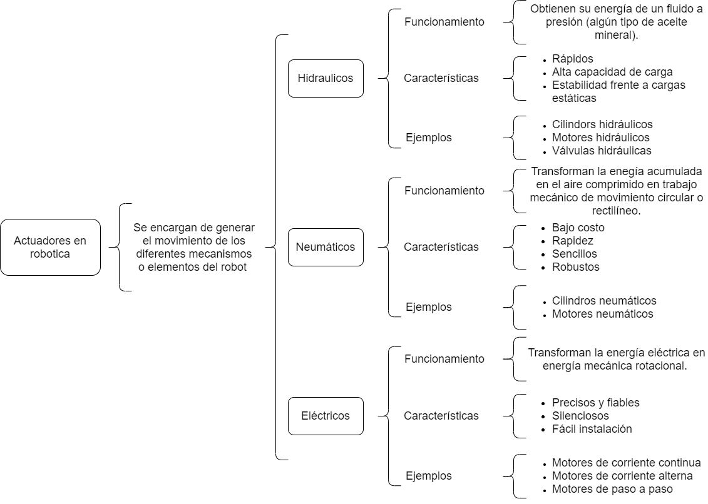

# Actuadores

## :trophy: C2.1 Reto en clase

**Actuadores Neumatico e Hidraulicos, y sus tipos**

### :blue_book: Instrucciones

- De acuerdo con la información presentada por el asesor referente al tema actuadores y a los videos observados sobre el mismo tema, elabore lo que se solicita dentro del apartado desarrollo.
- Toda actividad o reto se deberá realizar utilizando el estilo **MarkDown con extension .md** y el entorno de desarrollo VSCode, debiendo ser elaborado como un documento **single page**, es decir si el documento cuanta con imágenes, enlaces o cualquier documento externo debe ser accedido desde etiquetas y enlaces.
- Es requisito que el archivo .md contenga una etiqueta del enlace al repositorio de su documento en Github, por ejemplo **Enlace a mi GitHub**
- Al concluir el reto el reto se deberá subir a github el archivo .md creado.
- Desde el archivo **.md** se debe exportar un archivo **.pdf** con la nomenclatura **C2.1_NombreAlumno_Equipo.pdf**, el cual deberá subirse a classroom dentro de su apartado correspondiente, para que sirva como evidencia de su entrega; siendo esta plataforma **oficial** aquí se recibirá la calificación de su actividad por individual.
- Considerando que el archivo .pdf, fue obtenido desde archivo .md, ambos deben ser idénticos y mostrar el mismo contenido.
- Su repositorio ademas de que debe contar con un archivo **readme**.md dentro de su directorio raíz, con la información como datos del estudiante, equipo de trabajo, materia, carrera, datos del asesor, e incluso logotipo o imágenes, debe tener un apartado de contenidos o indice, los cuales realmente son ligas o **enlaces a sus documentos .md**, _evite utilizar texto_ para indicar enlaces internos o externo.
- Se propone una estructura tal como esta indicada abajo, sin embargo puede utilizarse cualquier otra que le apoye para organizar su repositorio.  
``` 
| readme.md
| | blog
| | | C2.1_x.md
| | | C2.2_x.md
| | | C2.3_x.md
| | img
| | docs
| | | A2.1_x.md
| | | A2.2_x.md
```

### :pencil2: Desarrollo

Listado de preguntas:

1. Basándose en el video [actuadores en Robótica](https://www.youtube.com/watch?v=e_6rjEGWqoY), realice un cuadro sinóptico sobre la clasificación de los actuadores.



2. De acuerdo con el video [descripcion de los actuadores industriales](https://www.youtube.com/watch?v=mFsPxpFHajM) realice una matriz comparativa indicando clasificacion, subclasificacion, principio de funcionamiento, ventajas y desventajas.

| Clasificación | Subclasificación | Principio de funcionamiento | Ventajas | Desventajas |
| ------------| ------------- | ---------------- | --------------------------- | -------- | ----------- |
| Eléctrico | Motores de corriente continua | Motor | Amplio rango de potencias. Control de velocidad preciso. Permite un control de par preciso. Es reversible. | Su construcción es menos robusta. Requiere mayor mantenimiento. Mayor tamaño por unidad de potencia. |
| Eléctrico | Motores de corriente alterna (asíncronos) | Motor | Coste bajo. Robusto. Puede controlarse mediante maniobas por contactores sencillas. Puede controlarse de forma más precisa mediante un variador de frecuencia. | Su velocidad depende de la carga. El coste del variador incrementa el coste del motor. |
| Eléctrico | Motor de corriente alterna (síncronos) | Motor | Mantienen su velocidad independiente de la carga. dependiendo unicamente de la frecuencia. Mejora el factor de potencia con respecto a los motores asíncronos. | Son más caros y complejos que los motores asíncronos. Requieren de un sistema de arranque auxiliar hasta alcanzar la velocidad de sincronismo. Requieren un mayor mantenimiento. |
| Eléctrico | Motores paso a paso | Motor | Posicionamiento muy preciso. Permite velocidades muy bajas. | Potencia muy limitada. |
| Eléctrico | Servomotores eléctricos | Motor | Posicionamiento muy preciso, apto para el control de máquinas herramienta, o como preaccionador de válculas de control, etc. | Requieren de un circuito de control interno. La potencia es muy limitada. |

3. De acuerdo con el video [Neumática Industrial](https://www.youtube.com/watch?v=Wee85cI6wwQ&t=394s), explique como trabaja un sistema Neumático?

R: Un compresor genera la energia que alimentara al sistema en forma de aire comprimido, el cual viajara por un tubo lineal al siguiente componente llamado unidad de preparación de aire (FRL) es decir un filtro regulador lubricador. Dentro del FRL lo primero que hace es separacion de liquidos, eliminando la humedad no deseada, la siguiente unidad por la que pasa el aire comprimido se encarga de eliminar las particulas y humedad atrapando los contaminantes no deseados. Despues de esto es comun ajustar el nivel de presion de aire que sale del compresor ya que esto tiene impacto en cuanta fuerza genera el sistema, una presion mas alta permite al actuador ejercer más fuerza en cambio una presion mas baja genera menos fuerza. Se puede agregar un lubricador para distribuir una fina brisa de lubricante en el aire comprimido que ayude a lubricar los componentes que siguen el flujo de aire.

Una vez que el aire comprimido está limpio, seco y establecido en la presion correcta para la aplicacion se debe dirigir hacia donde se desea crear movimiento con ayuda de una válvula de control direccional el cual cuenta con una serie de vías internas que pueden conectar el aire que llega al puerto de entrada con una o dos vías en la salida de la váalvula llamados puertos de trabajo, dependiendo de la posicion de los elementos móviles los cuales son llamados carretes el aire sera bloqueado para pasar por un puerto y permitirá su paso por el otro, las secciones altas en el carrete llamadas discos impedirán que el aire avance por un camino mientras que las secciones inferiores surcos permitirán el flujo a su alrededor para avanzar a uno de los puertos de trabajo. Cuando la unidad no esta accionada el carrete es forzado hacia el lado izquierdo de la válcula por un resorte y el disco impide que el aire salga por uno de los puertos en cambio es forzado a salir por el otro puerto debido a que el surco en la sección inferior del carrete permite que el aire fluya y pase por uno de los puertos de trabajo para cambiar la dirección del aire hacia el otro puerto de trabajo. En la mayoria de estos sistemas automatizados un controlador lógico programable (PCL) dará la orden a la válvula para cambiarla mediante una señal eléctrica, cuando llega una señal en la bobina del sol dentro de la válvula se crea un campo magnético que atrae hacia ella una pieza central llamada embolo que cuando no está asentado permite que el aire del interior de la válvula empuje este carrete hacia la derecha, una vez que este carrete llega al extremo derecho de la válvula el disco o secciones altas cierran el paso hacia el puerto de trabajo del lado derecho y dirige el flujo de aire al puerto de trabajo del lado izquierdo. Cuando se elimina la señal del PLC también se elimina la fuerza generada por un electroimán en tal punto el resorte del émbolo vuelve a su estado inicial lo que elimina la señal de aire. 
El siguiente componente que es el actuador (cilindros) permitirá realizar un trabajo útil con el aire comprimido que ya ha sido limpiado y redirigido con el propósito de crear movimiento en cualquier dirección, estos cilindros convierten el aire comprimido en movimiento. Cuando el aire comprimido empuja el pistón es forzado a moverse hacia adelante adentro del tubo, el pistón está unido a un váastago que se extiende como resultado de la fuerza generada por el aire comprimido que actúa sobre el pisón y el actuador continuará moviéndose en esa dirección hasta que alcance su límite físico o si la resistencia a la fuerza es mayor que la fuerza del aire comprimido.

### :bomb: Rubrica

| Criterios     | Descripción                                                                                  | Puntaje |
| ------------- | -------------------------------------------------------------------------------------------- | ------- |
| Instrucciones | Se cumple con cada uno de los puntos indicados dentro del apartado Instrucciones?            | 20 |
| Desarrollo    | Se respondió a cada uno de los puntos solicitados dentro del desarrollo de la actividad?     | 80      |

___
## :link: [Enlace a mi repositorio](https://github.com/CMRamirezC/Sistemas_Programables_Ramirez_Cervantes.git) :link:
